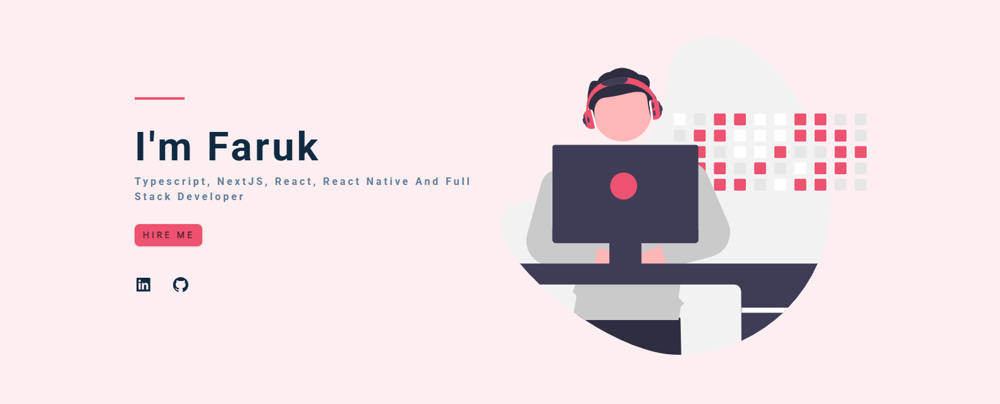

# Hello World! 👋🏼 I'm Faruk

> A Full Stack Web Developer passionate about building accessible, beautiful interfaces

## 🚀 About Me

- 🛜 Building innovative web projects - check out my [portfolio](https://faruk-portfolio-v2.netlify.app/)
- 👨🏼‍🎓 MCA Graduate (2024) from Pune University
- 🏢 Working as a Full Stack Web Developer since 2024
- 💻 Specialized in Next.js, TypeScript, and Tailwind CSS
- 🌱 Always eager to learn, collaborate, and grow in the tech community

# 💻 Tech Stack:

<!-- Frontend -->

<!-- Backend -->

<!-- Database -->

<!-- Tools & Platforms -->

<picture>

  <source media="(prefers-color-scheme: dark)" srcset="https://raw.githubusercontent.com/faruk-mansuri/faruk-mansuri/output/github-snake-dark.svg" />
  <source media="(prefers-color-scheme: light)" srcset="https://raw.githubusercontent.com/faruk-mansuri/faruk-mansuri/output/github-snake.svg" />
  
</picture>
